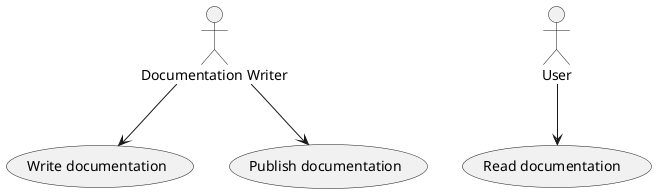

## Visual Studio Code

You can get help with markdown and preview here as well with plugins:

### [Markdown All in One](https://marketplace.visualstudio.com/items?itemName=yzhang.markdown-all-in-one)

### [PlantUML VS Code plugin](https://marketplace.visualstudio.com/items?itemName=jebbs.plantuml)

 1. In jebbs.plantuml plugin setting set plantuml.server to http://anansi.setekgroup.local:8081
 2. Allow http on localhost if you get a warning about http*

## PlantUML Diagrams

[PlantUML](https://plantuml.com/) can be used to generated diagrams

*Example*
```
@startuml
"Documentation Writer" as writer
"Read documentation " as (read)
writer --> (Write documentation)
writer --> (Publish documentation)
:User: --> (read)
@enduml
```

*Rendered as*


### Use Own PlantUML Server

`mkdocs build` needs access to server which we run on [anansi.setekgroup.local:8081](http://anansi.setekgroup.local:8081).

You can edit the server name in `mkdocs.yml` and run your own elsewhere, e.g. localhost, but make sure you don't commit changes to this file.
```
docker run -d --name plantuml -p 8081:8080 plantuml/plantuml-server:tomcat
```
