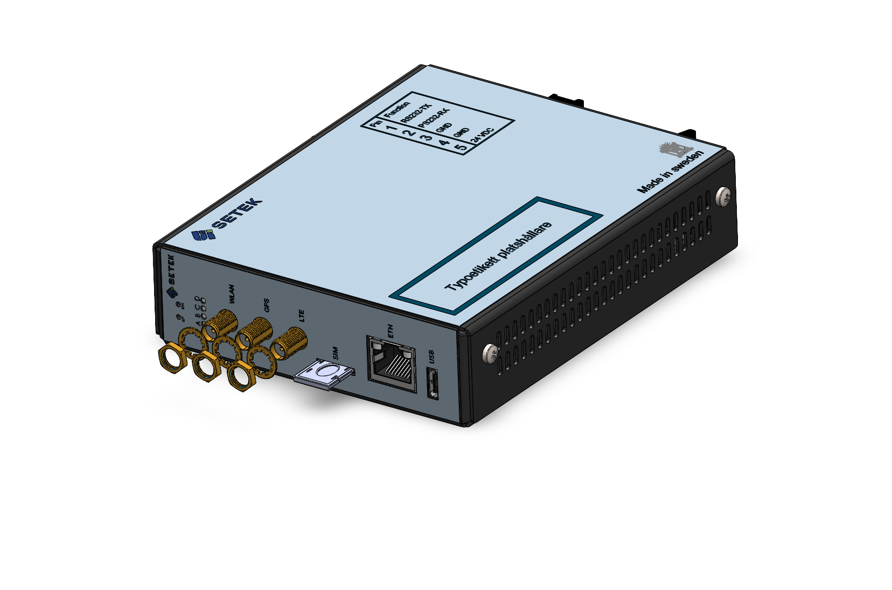
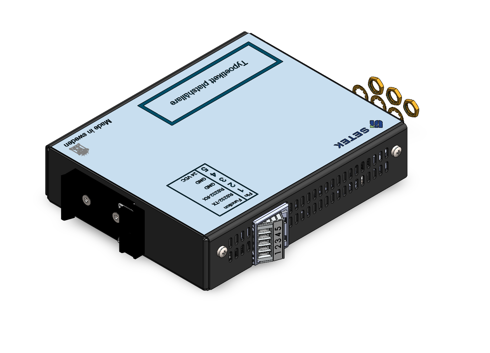

## Abstract

The Host Monitor Mini is an industrial Linux-based edge-computing device in a DIN-rail mountable enclosure.

## Features lists 

### Feature for Hm020

| Feature | Description
| --- | ---
| Housing | galvanized metal, 110(117)x134(153)x32mm (in parenthesis connector front to back din-rail clip)
| Operating Temperature | -5C to +65C 
| Nominal Voltage | 24V
| Operating System | Yocto Scarthgap, Linux kernel 6.6 
| Protection | IP20 
| [Low power mode](../system/power_management.md)  | Suspend to RAM. 

### Feature summary for HM020-100W01

This product is shipped with a custom distribution/BSP and an application called Liam.

| Feature | Description
| --- | ---
| CPU | Texas Instruments AM625 Solo 1.4 GHz A53 (64 bit) with Cortex M4F 400 MHz co-processor 
| RAM | 512 MB DDR4
| Internal Storage | 4 GB eMMC
|Interface| Description|
| [Ethernet](../interfaces/ethernet.md) |  1 x 100/1000 Base-T
| [GPS](../interfaces/hmm/modem.md) | Included in modem, external antenna
| [LEDs](../interfaces/leds.md) | 4 x red+green (yellow in combination)
| [Modem](../interfaces/modem/modem.md) | Quectel EG21 GL
| [Real Time Clock](../interfaces/rtc.md) | No battery mounted; please use network time
| [RS-232](../interfaces/serial.md) | 1 x RS-232 bus 
| SIM | nanoSIM, hot-swap
| [USB](../interfaces/hmm/usb.md) | USB 2.0 OTG type C
| [WIFI](../interfaces/wifi.md) | 802.11 b/g/n WiFi |

### Feature summary for HM020-000W51

This version of the product is shipped with a custom distribution BSP as a reference OS.

| Feature | Description
| --- | ---
| CPU | Texas Instruments AM625 Solo 1.4 GHz A53 (64 bit) with Cortex M4F 400 MHz co-processor 
| RAM | 512 MB DDR4
| Internal Storage | 4 GB eMMC
|Interface| Sumary|
| [CAN](../interfaces/can.md) | 2 x CAN-FD
| [Ethernet](../interfaces/ethernet.md) |  1 x 100/1000 Base-T
| [GPS](../interfaces/hmm/modem.md) | Included in modem, external antenna connector (SMA)
| [HSM](../interfaces/hsm.md) | Hardware security module
| [LEDs](../interfaces/leds.md) | 4 x red+green (yellow in combination)
| [Modem](../interfaces/modem/modem.md) | Quectel EG21 GL
| [Real Time Clock](../interfaces/rtc.md) | System time keeper and wakeup, power backed up by BR1220 coin cell battery TODO!!!!!!!!!!!!!!!!!!!!!!!!!!!!TODO remove?!
| [RS-232](../interfaces/serial.md) | 1 x RS-232 bus
| [RS-485](../interfaces/serial.md) | 1 x RS-485 bus
| SIM | nanoSIM, hot-swap
| [USB](../interfaces/hmm/usb.md) | USB 2.0 OTG type C
| [Universal I/O](../interfaces/hmm/digital_io.md) | with individual modes | 
| [WIFI](../interfaces/wifi.md) | 802.11 b/g/n WiFi* | Optional/Bluetooth

### Feature(s) on request 

See [Production Variant Definition](#production-variant-definition) if your variant is already a product available for sale.

| Feature           | Summary                                                   | Mounted/Optional                      |
|-------------------|-----------------------------------------------------------|---------------------------------------|
| CPU               | TI AM625 1.4 GHz A53 (64-bit) with Cortex M4 400MHz co-processor | Solo / Optional dual or quad   |
| RAM               | 512 MB DDR4                                               | - / 1GB or 2GB option                 |
| Internal Storage  | 4 GB eMMC                                                 | - / 4GB to 16GB                       |
| External Storage  | µSD Card                                                  | Optional / -                          |

| Interface                                 | Description                                   | Mounted/Optional                        |
|-------------------------------------------|-----------------------------------------------|-----------------------------------------|
| [Bluetooth](../interfaces/bluetooth.md)   | Bluetooth Low Energy 5.2*                     | Optional / Wi-Fi                       |
| [CAN](../interfaces/can.md)               | 2 x CAN-FD                                     | Optional / -                           |
| [Ethernet](../interfaces/ethernet.md)     | 1 x 100/1000 Base-T                           | Always / -                             |
| [GPS](../interfaces/hmm/modem.md)         | Included in modem, external antenna           | Always / -                             |
| [HSM](../interfaces/hmm/hsm.md)           | Hardware security module                        | Optional / -                           |
| [LEDs](../interfaces/leds.md)             | 4 x red+green (yellow in combination)           | Always / -                             |
| [Real Time Clock](../interfaces/rtc.md)   | System time keeper and wakeup                 | Optional / Optional power-backed by BR1220 coin cell battery |
| [RS-232](../interfaces/serial.md)         | 1 x RS-232 bus                                | Always / -                             |
| [RS-485](../interfaces/serial.md)         | 1 x RS-485 bus                                | Optional / -                           |
| SIM                                       | NanoSIM, hot-swap                             | Always / -                             |
| [USB](../interfaces/hmm/usb.md)           | USB 2.0 OTG Type-C                            | Always / -                             |
| [Universal I/O](../interfaces/hmm/io.md)  | With individual modes                         | Optional / -                           |
| [WIFI](../interfaces/wifi.md)             | 802.11 b/g/n WiFi*                            | Optional / Bluetooth                   |

* *You can only choose either BLE or WiFi as there is only one SMA connector in this design.

## Production variant definition

The product part numbers start with HM020-\*\*\*\*\*-revision, read from right to left.

### Processor module

Position in field: xxxxxX

| Processor ID | Module Part Number      | Additional Details                   | 
|--------------|-------------------------|--------------------------------------|
| 0            | No module               |                                      |
| 1            | hMOD0014 (Arena)        | Verdin AM62 Solo 512MB WB (WiFi) IT  |
| 2            | - (Arena)               | Verdin AM62 Dual 1GB WB IT           |
| 3            | - (Arena)               | Verdin AM62 Dual 1GB WB IT           |
| 4            | - (Arena)               | Verdin AM62 Quad 2GB WB IT           |

### CAN-FD, WiFi/BT, UNIV I/O, Accelerometer, Real-time Clock Battery, and Modem Features

Position in field: xxxXXx

| Variant ID | Feature CAN | Feature RS-485 | Feature UNIV I/O | Feature Accelerometer | Feature WiFi/BT | Real-time Clock Battery | Modem Type | PCBA |
|------------|------------|----------------|-------------------|----------------------|----------------|------------------------|------------|------------|
| W0         | No         | No             | No                | No                   | WiFi           | No                      | EG21GL     | HMP1031-11 |
| W1         | No         | No             | 2x                | No                   | WiFi           | No                      | EG21GL     | HMP1031-12 |
| W2         | 2x         | No             | No                | No                   | WiFi           | No                      | EG21GL     | HMP1031-13 |
| W3         | 2x         | No             | 2x                | No                   | WiFi           | No                      | EG21GL     | HMP1031-14 |
| W4         | No         | No             | No                | Yes                  | WiFi           | No                      | EG21GL     | HMP1031-15 |
| W5         | 2x         | Yes            | 2x                | No                   | WiFi           | No                      | EG21GL     | HMP1031-16 |
| -          | -          | -              | -                 | -                    | -              | -                      | -          | -          |
| B0         | No         | No             | No                | No                   | BT             | No                      | EG21GL     | HMP1031-11 |
| B1         | No         | Yes            | 2x                | No                   | BT             | No                      | EG21GL     | HMP1031-12 |
| B2         | 2x         | No             | No                | No                   | BT             | No                      | EG21GL     | HMP1031-13 |
| B3         | 2x         | Yes            | 2x                | No                   | BT             | No                      | EG21GL     | HMP1031-14 |
| B4         | No         | No             | No                | No                   | BT             | No                      | EG21GL     | HMP1031-15 |
| B5         | 2x         | Yes            | 2x                | No                   | BT             | No                      | EG21GL     | HMP1031-16 |

### SD-Card

Position in field: xxXxxx

| Variant ID | SD-Card receptacle | Additional Details                       |
|------------|--------------------|------------------------------------------|
| 0          | Not fitted         | No mass-storage option   |

### SIM Card

Position in field: xxXxxx

| Variant ID | Nano-SIM Card | Additional Details                       |
|------------|---------------|------------------------------------------|
| 0          | Not fitted    | No SIM card included                     |

### Custom BSP/OS
Position in field: XXxxxx

This is for customers that want extra installation of software, additional labels or similar within design limitations.

| Customer ID | Customer Tweaks | Description
|-------------|-----------------|--------------------------------------------------------------------|
| 0           | Default         | No customization, only delivered with our reference BSP            |
| 1           | <Reserved>      | Reserved for customer using the Liam application and a custom BSP  |
| n           | <Reserved>      | -                                                                  |

  
### List of known products

| Products   | Product part number | Description
|------------|---------------------|---------------------------------------------------|
| Default    | HM020-000W51        | Only delivered with our reference BSP             |
| <Reserved> | HM020-100W01        | Reserved for customer using the Liam application  |

**Note:** For SETEK employees, update this page after making changes to the internal document 900126-HM Mini Variant definitions and encoding.

## Connectors and buttons

## Technical specification

Please contact [support](../support.md) to receive a detailed technical specification for this hardware.
