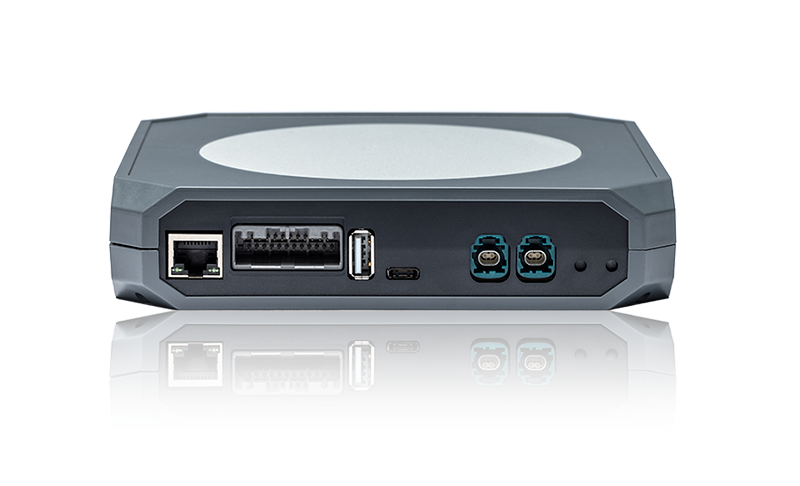

## Abstract

Host Monitor X is the next generation telematics computer for modern automotive development.

## Feature summary for HM010-\*\*\*\*1

See [Production Variant Definition](#production-variant-definition)

| Feature | Summary
| --- | ---
| CPU | NXP i.MX 8M Plus (64 bit) with Cortex M7 co-processor
| [Accelerometer](../interfaces/accelerometer.md) | 3-axis
| [Buzzer](../interfaces/digital_io.md) | Internal and power for external
| [CAN](../interfaces/can.md) | 6x CAN-FD
| [Ethernet](../interfaces/ethernet.md) |  2x 100/1000 Base-T1 (Rosenberger), 2x 100-BaseTx (RJ45 and MX34)
| External Logging | µSD Card
| [GPS](../interfaces/hmx/modem.md) | Included in modem, external antenna
| Housing | Aluminium/plastic
| [Start Signals](../interfaces/start_signal.md) | External input, 2.5-36V (5 inputs)
| Internal Storage | 64 GB eMMC
| [LEDs](../interfaces/leds.md) | 5 red+green (yellow in combination), 1 RGB
| [Modem](../interfaces/modem/modem.md) | 5G or 4G, M2 connector
| Nominal Voltage | 12-24V
| Operating Temperature | -40C to +65C
| Operating System | Yocto Kirkstone, Linux kernel 6.1
| Power Consumption @12V | < 1 mA in "Off", 25 mA  in "Suspend to RAM"
| Protection | IP30
| RAM | 4 GB DDR4
| [Real Time Clock](../interfaces/) | Yes, backed up by CR2032 coin cell battery
| SIM | nanoSIM
| Low power mode | Suspend to RAM. Wakes on CAN, digital inputs, accelerometer, RTC, and start signals
| Size without connectors | 164x164x30mm
| UPS | 3 seconds supercap power
| [USB](../interfaces/hmx/usb.md) | USB 3.0 OTG type C, USB 2.0 host type A
| [Sleep-Mode](../system/power_management.md) | Low power sleep mode |

## Production variant definition

The production part numbers start with HM010-\*\*\*\*\*-revision, read from left to right. For the first variant number, the processor module is followed by the modem. If no other parameters are stated, the part number will be HM010-00011-revision.

### Processor module

| Processor ID | Module Part Number                 | Description                                         |
|--------------|------------------------------------|-----------------------------------------------------|
| 0            | No module                          |                                                     |
| 1            | hMOD0009-R1A (Arena)               | i.MX 8M Plus with Quad Core CPU, 4GB DRAM and 64GB EMMC              |
| 2            | TBD (Arena)                        | i.MX 8M Plus with Quad Core CPU, 4GB DRAM, 64GB EMMC and Wi-Fi. |

### Modem module

| Modem ID | Module Part Number     | Description             |
|----------|------------------------|-------------------------|
| 0        | No module              |                         |
| 1        | hMOD0010-03 (Arena)    | 4G global modem         |
| 2        | TBD (Arena)            | 5G global modem         |
| n…       |                        |                         |

### Micro SD Card module

| Micro SD Card ID | Module Part Number | Description                             |
|------------------|---------------------|-----------------------------------------|
| 0                | No SD card          |                                         |
| 1                | hBMT0003 (Arena)    | Samsung uSDHC EVO 32GB Class 10         |
| 2                | hBMT0002 (Arena)    | 32GB Sandisk UHS Class 1                 |

### SIM Card module

| SIM Card ID | Module Part Number | Description             |
|-------------|---------------------|-------------------------|
| 0           | No module           |                         |
| 1           | <Reserved>          | Reserved for customer   |

### Customer customization

This is for customers that want extra installation of software, additional labels or similar within design limitations.

| Customer ID | Customer Tweaks | Description                                            |
|-------------|-----------------|--------------------------------------------------------|
| 0           | Default         | No customization, only delivered with our reference BSP |
| 1           | <Reserved>      | Reserved for customer                                  |

### List of known products

| Products | Product part number | Description                                            |
|-------------|-----------------|--------------------------------------------------------|
| Default |   HM010-00111-V6B           | 4G modem and SD card, only delivered with our reference BSP |
| <Reserved>           | HM010-11111-V6B      | Reserved for customer with 4G modem, SIM card, SD card and customization |

**Note:** For Host Mobility employees, update this page after making changes to internal document FILE-000768 (800155-HMX-Product label spec).

## Connectors and buttons

See [Connectors and buttons (pdf)](../assets/800125_HMX%20connectors%20and%20buttons.PDF)

## Technical specification

Please contact [support](../support.md) to receive detailed technical specification for this hardware.