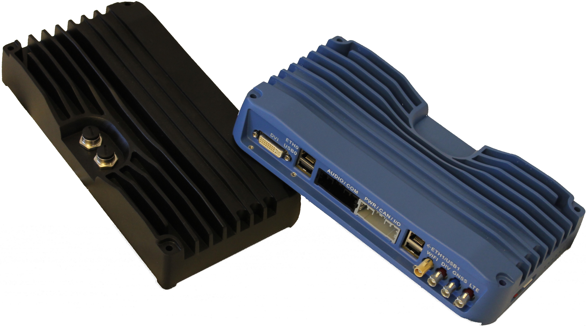
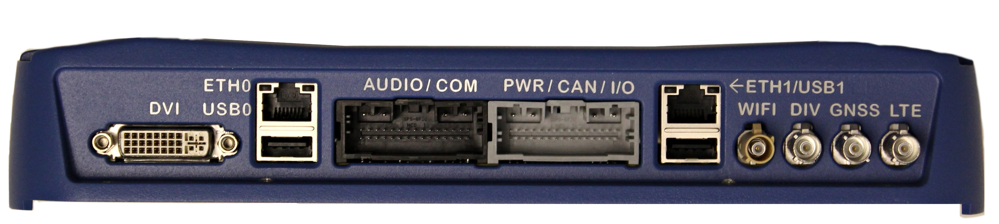
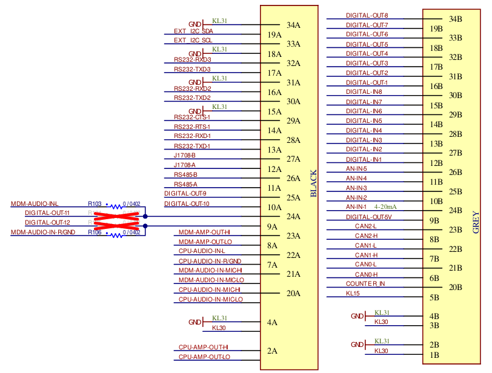

## Overview and installation

### Connectors

The MX-V has the following connectors accessible from the outside.

1. DVI connector for display
2. two RJ45 Ethernet ports
3. two USB type A connectors
4. antenna connectors for GPS, WiFi and mobile
5. 34-pin I/O connector, including serial interfaces, see below
6. 34-pin I/O connector, including power and CAN, see below
7. SDHC card slot
8. SIM card slot
9. Optional M12 connectors for ethernet (can not be combine with RJ45 ports)

### I/O connectors

#### Power

KL30 is positive power terminal (red) and KL31 is negative (black). The units
start when KL15 (yellow ignition input) is connected to positive input (e.g.
battery voltage).

#### Digital out

The digital out channels can both source and sink a load. When sourcing,
enabling the channel (output pin) connects it to **battery voltage**, while
sinking connects the channel to ground.

#### Analog/Digital in

The (5+8) analog/digital in channels can measure voltages up to 32V. The
difference lies in the hardware filtering where analog is filtered at 25Hz
and digital at 250Hz.

### Initial setup

* Connect either Ethernet connector to a router to get an IP address
  through DHCP. Alternatively, connect a male to male USB-A cable between
  the MX-V and your workstation for direct network access.

* You can also access the machine without a workstation by connecting
  a computer monitor along with a keyboard.

* Connect the MX-V harness to a power supply in the range 9 to
  32V. Then nominal voltage is 24V.

The MX-V boots automatically when power and ignition are applied. The boot
time depends on the configuration. For the current development
build with a lot of things enabled it takes about 15 seconds.

### Operating system

The Host Mobility MX-V platform runs a custom built GNU/Linux operating system.
The current kernel version is 4.19. To load the kernel, the U-Boot bootloader
is used. The operating system for the MX-V is installed on the on-board eMMC
memory. It contains the U-boot, kernel image plus device tree as well as the root
file system.

The MX-V is delivered with the operating system installed and you can login
through a secure shell (SSH).
