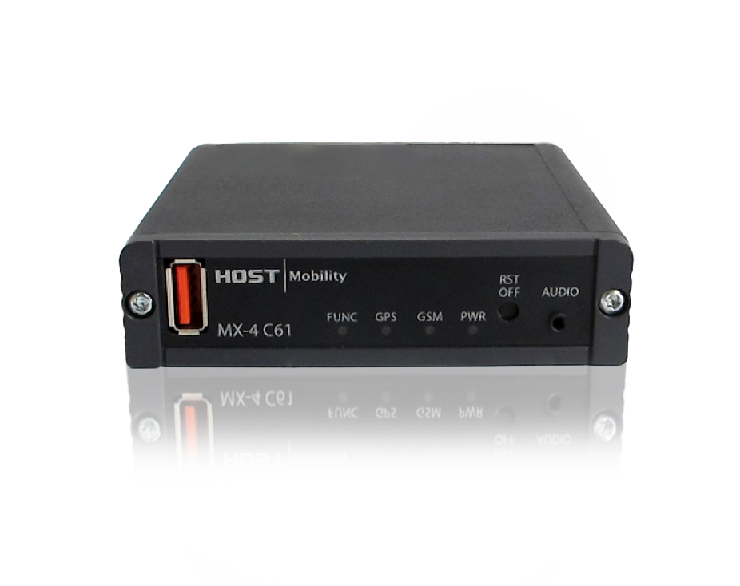
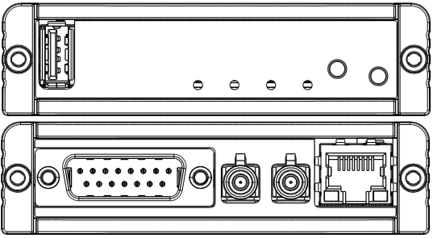

## Abstract

MX-4 C61 is a small form factor and low cost telematics computer for remote diagnostics and fleet management.

## Feature summary for HM005-1

See [Production variant definition](#production-variant-definition).

| Feature | Summary
|------------|-----------------------------------------------------|
| CPU (main) | ARM Cortex-A5, 500 MHz single core              |
| CPU        | ARM Cortex-M4, 167 MHz single core              |
| Coprocessor        | PIC24              |
| RAM        | 512 MB flash, 256 MB RAM                            |
| Operating System | Yocto Kirkstone, Linux kernel 4.19
| [Modem](../interfaces/c61/modem.md)      | Global 4G module                                    |
| [GPS](../interfaces/c61/modem.md#gps) | Included in modem, external antenna
| Aux-Linux  | 1x 3pol aux for Linux Headphone L and R with mic    |
| [Ethernet](../interfaces/c61/ethernet.md)   | 10BASE-T and 100BASE-TX Ethernet |                          |
| [USB](../interfaces/c61/usb.md)        | 1 x USB 2.0 high-speed host/device (auto detect)    |
| [CAN](../interfaces/c61/can.md)        | 3 x CAN 2.0 B                                       |
| RS485/J1708| 1 x Rs-485 (or 1x J1708), product selection                            |
| [RS-232](../interfaces/c61/serial.md)     | 1 x Rs-232                                          |
| DIO-Analog | Combine digital in, out and analog in |
| [Start Signals](../interfaces/mx4/start_signal.md)    | 1 x Start signal input (to boot the system using external signal) |
| uSD-card   | µSD-card interface                                  |
| SuperCap   | Super Capacitor                                     |
| Operating Temperature   | Wide operating temperature: -40 to +85°C             |
| Operating voltage | Wide input voltage range, 8-36 VDC                    |
| Nominal Voltage | 12-24V
| [Sleep-Mode](../system/power_management.md) | Low power sleep mode |

## Production Variant Definition

### List of known products

| Products | Product part number | Description                                            |
|-------------|-----------------|--------------------------------------------------------|
| Default |   HM005-1           | 4G modem and SD card, only delivered with our reference BSP |

## Connectors and buttons

### Dsub 15 connector

| Pin | Function                                           | Comment                                                   |
|-----|----------------------------------------------------|-----------------------------------------------------------|
| 1   | CAN-1-H                                            |                                                           |
| 2   | CAN-1-L                                            |                                                           |
| 3   | CAN-2-H                                            |                                                           |
| 4   | CAN-2-L                                            |                                                           |
| 5   | CAN-3-H                                            |                                                           |
| 6   | CAN-3-L                                            |                                                           |
| 7   | INPUT-POWER                                        |                                                           |
| 8   | GND                                                | Reference for INPUT-POWER                                 |
| 9   | DIG-IO-1                                           | Output with source and sink and/or analog in and/or digital in |
| 10  | RS-485 or J1708                                    | RS-485A or J1708A (default variant is RS-485 not J1708) |
| 11  | DIG-IO-2                                           | Output with source and sink and/or analog in and/or digital in |
| 12  | RS-485 or J1708                                    | RS-485B or J1708B (default variant is RS-485 not J1708) |
| 13  | START-SIGNAL                                       | Must be tied to INPUT-POWER for the unit to start          |
| 14  | RS-232_RXD                                         | Rs-232 receive from pc (default debug)                    |
| 15  | RS-232_TXD                                         | Rs-232 transmit from device to pc (default debug)         |
| S   | GND                                                | The shield acts as a general-purpose GND                   |

### Other connector and buttons

- Fakra red LTE/4G
- Fakra blue GPS
- RJ45
- Audio & mic
- Reset button
- [LEDs](../interfaces/mx4/leds.md)

## Technical specification

Contact [support](../support.md) to receive the technical specification (1301-HM005-Technical-description) for this hardware.