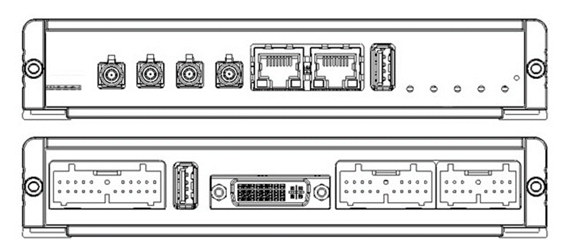
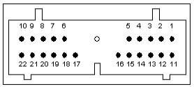
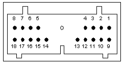
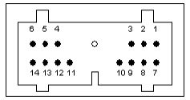

## Abstract

MX-4 CT GL is a telematics computer for remote diagnostics and fleet management. This product can no longer be bought and similar functionality can be found on other products from us. So this page is for those that already have bought the CT GL product.

## Feature summary for HM001 (CT GL)

See [Production variant definition](#production-variant-definition).

| Feature | Summary |
|---------|---------|
| CPU (main) | ARM Cortex-A9 CPU, Up to 1 GHz, dual Core |
| Coprocessor | PIC24 |
| RAM | 1GB SLC NAND flash, 512 MB RAM |
| Operating System | Ångstrom distribution built with yocto , Linux kernel  3.1.10 |
| HDMI | 1920x1080 |
| VGA | 1400x1050 |
| [Modem](../interfaces/mx4/modem.md) | Global modem 4G (or for CT Europa or USA 4G module) |
| [GPS](../interfaces/mx4/modem.md#gps) | Included in modem, external antenna |
| [Modem audio](../interfaces/modem/quectel.md#audio) | Modem Headphone L and R and mono mic |
| Linux audio | Linux Headphone L and R and mono mic |
| [WIFI](../interfaces/mx4/wifi.md) | 802.11 b/g/n WiFi |
| [Ethernet](../interfaces/mx4/ethernet.md) | 1x 10BASE-T and 100BASE-TX Ethernet |
| [Ethernet](../interfaces/mx4/ethernet.md) | 1x 100BASE-TX and 1000BASE-T Ethernet, limit by USB 2.0 transfer |
| [USB](../interfaces/mx4/usb.md) | 1 x USB 2.0 high-speed host/device (auto detect) |
| [USB](../interfaces/mx4/usb.md) | 1 x USB 2.0 high-speed host |
| [CAN](../interfaces/mx4/can.md) | 3 x CAN 2.0 B |
| [J1708](../interfaces/j1708.md) | 1 x J1708 bus |
| [RS-232](../interfaces/serial.md) | 2 x RS-232 bus |
| [RS-485](../interfaces/serial.md) | 1 x RS-485 bus |
| [Digital inputs](../interfaces/mx4/digital_io.md) | 6 x Digital inputs |
| [Digital outputs](../interfaces/mx4/digital_io.md) | 7 x Digital outputs sink and source (older CT includes less functionality) |
| Digital output 5V | 1 x Digital output 5V |
| [Tachometer](../interfaces/tachometer.md) | 1x Puls counter |
| [Analog inputs](../interfaces/mx4/analog.md) | 1 x Analogue inputs (4-20 mA) |
| [Analog inputs](../interfaces/mx4/analog.md) | 4 x Analog inputs 0-32 VDC (including the start signal) |
| [Start Signals](../interfaces/mx4/start_signal.md) | 1 x Start signal input (to boot the system using external signal) |
| SD-card | SD-card interface |
| Operating Temperature | Wide operating temperature: -40 to +70°C |
| Operating voltage | Wide input voltage range, 8-32 VDC |
| Nominal Voltage | 12-24V |
| [Sleep-Mode](../system/power_management.md) | Low power sleep mode |

## Production variant definition

### List of known products

Contact Host Mobility.
All product of CT GL variants start with HM001.
Older Products called CT starts with HMP069.

## Connectors and buttons

### Connector – Digital and Analog I/O

| Pin | Function         | Comment                                             |
|-----|------------------|-----------------------------------------------------|
| 1   | CAN-1-H          |                                                     |
| 2   | CAN-1-L          |                                                     |
| 3   | CAN-2-H          |                                                     |
| 4   | CAN-2-L          |                                                     |
| 5   | DIG-OUTPUT-6     | 400mA current limitation                            |
| 6   | 4-20mA-PWR       | Digital output 5, 400mA current limitation         |
| 7   | DIG-OUTPUT-1     | 400mA current limitation                            |
| 8   | DIG-OUTPUT-2     | 400mA current limitation                            |
| 9   | DIG-OUTPUT-3     | 400mA current limitation                            |
| 10  | DIG-OUTPUT-4     | 400mA current limitation                            |
| 11  | DIG-INPUT-1      |                                                     |
| 12  | DIG-INPUT-2      |                                                     |
| 13  | DIG-INPUT-3      |                                                     |
| 14  | DIG-INPUT-4      |                                                     |
| 15  | DIG-INPUT-5      |                                                     |
| 16  | DIG-INPUT-6      |                                                     |
| 17  | DIG-OUTPUT-7     | 400mA current limitation                            |
| 18  | ANALOG-IN-1A     | 0-32 V input, either “A” or “B” must be high for the unit to start |
| 19  | ANALOG-IN-2      | 4-20 mA input                                       |
| 20  | ANALOG-IN-3      | 0-32 V input                                        |
| 21  | ANALOG-IN-4      | 0-32 V input                                        |
| 22  | PULSE-COUNTER    | Input for tachometer        |

### Connector – Power & Communication

| Pin | Function          | Comment                                             |
|-----|-------------------|-----------------------------------------------------|
| 1   | RS485-A           |                                                     |
| 2   | RS485-B           |                                                     |
| 3   | J1708-A           |                                                     |
| 4   | J1708-B           |                                                     |
| 5   | DIG-OUTPUT-5V     | Digital 5V output, for peripherals, 500mA current limitation |
| 6   | GND               | Digital Ground                                      |
| 7   | GND               | Digital Ground                                      |
| 8   | INPUT-POWER       |                                                     |
| 9   | GND               | Return for INPUT-POWER, connected to Digital Ground  |
| 10  | ANALOG-IN-1B      | 0-32 V input, either “A” or “B” must be high for the unit to start |
| 11  | ANALOG-IN-5       | 0-32V Input                                         |
| 12  | RS232-2-RXD       | RS-232 no. 2 - Data input                           |
| 13  | RS232-2-TXD       | RS-232 no. 2 - Data output                          |
| 14  | GND               | Digital Ground                                      |
| 15  | RS232-1-TXD       | RS-232 no. 1 - Data output                          |
| 16  | RS232-1-RTS       | RS-232 no. 1 - RTS output                           |
| 17  | RS232-1-CTS       | RS-232 no. 1 - CTS input                            |
| 18  | RS232-1-RXD       | RS-232 no. 1 - Data input                           |

### Connector – Audio & CAN

| Pin | Function          | Comment                                             |
|-----|-------------------|-----------------------------------------------------|
| 1   | MODEM-IN+         | Modem voice input positive                          |
| 2   | CAN-3-H           |                                                     |
| 3   | CAN-3-L           |                                                     |
| 4   | N/A               |                                                     |
| 5   | N/A               |                                                     |
| 6   | GND               | Analog measurement references, connected to Digital Ground |
| 7   | MODEM-IN -        | Modem voice input negative                          |
| 8   | MODEM-OUT+        | Modem voice output positive, (optional AUDIO-OUT-R) |
| 9   | MODEM-OUT-        | Modem voice output negative                         |
| 10  | GND-A             | Reference for Linux platform audio, isolated from Digital Ground |
| 11  | AUDIO-IN-MIC      | Linux platform audio input, with biasing voltage for microphone |
| 12  | AUDIO-IN-LINE     | Linux platform audio input, without biasing voltage |
| 13  | AUDIO-OUT-R       | Linux platform audio output, right                  |
| 14  | AUDIO-OUT-L       | Linux platform audio output, left                   |

### Other connector and buttons

- Fakra red LTE/4G
- Fakra red rx-diversity LTE/4G
- Fakra blue GPS
- RJ45
- Reset button
- [LEDs](../interfaces/mx4/leds.md)

## Technical specification

Contact [support](../support.md) to receive the technical specification (1301-HM001-*-Technical-description or older CT 1301-HMP069-*-Technical-description) for this hardware. * is the variant you have bought.