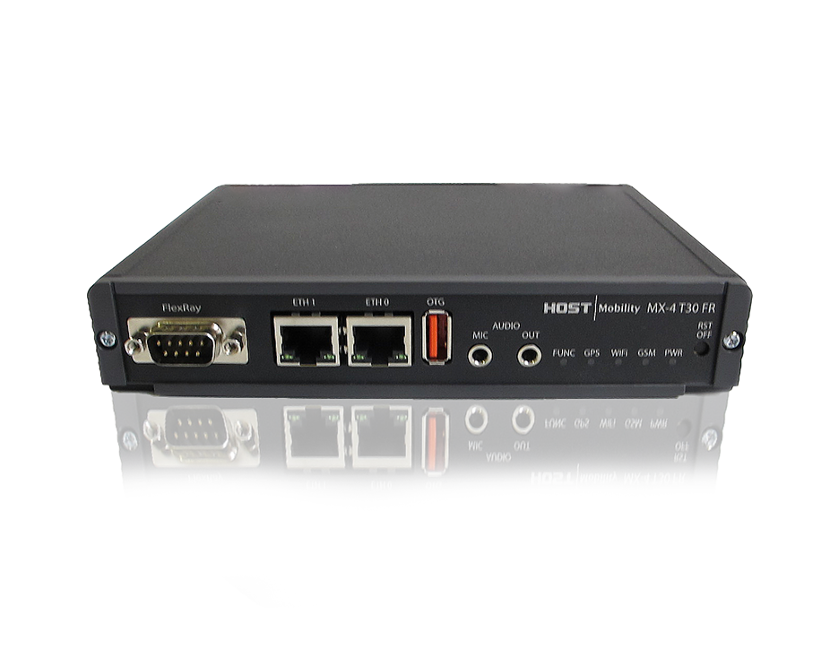

## Abstract

MX-4 T30 FR is a telematics computer for remote diagnostics and fleet management, very well suited for automotive development.

## Feature summary for HMP075 (flexray variant)

See [Production variant definition](#production-variant-definition).

| Feature | Summary |
|---------|---------|
| CPU (main) | ARM Cortex-A9 CPU, Up to 1.4 GHz, Quad Core |
| Coprocessor | PIC24 |
| RAM | 1GB flash, 1 GB RAM |
| Operating System | Yocto Kirkstone, Linux kernel 6.1 (and 3.1.10) |
| [Modem](../interfaces/mx4/modem.md) | Europa or USA 4G module |
| [GPS](../interfaces/mx4/modem.md#gps) | Included in modem, external antenna |
| Aux-Linux | 2x 3pol aux for Linux Headphone L and R and mic |
| [WIFI](../interfaces/mx4/wifi.md) | 802.11 b/g/n WiFi |
| [Ethernet](../interfaces/mx4/ethernet.md) | 2x 10BASE-T and 100BASE-TX Ethernet |
| [USB](../interfaces/mx4/usb.md) | 1 x USB 2.0 high-speed host/device (auto detect) |
| [USB](../interfaces/mx4/usb.md) | 1 x USB 2.0 high-speed host |
| [CAN](../interfaces/mx4/can.md) | 6 x CAN 2.0 B |
| [Flexray](../interfaces/mx4/flexray.md) | 1 x Flexray 2.1 / 2.1RevA |
| [LIN](../interfaces/mx4/lin.md) | 2 x LIN buses |
| [Digital inputs](../interfaces/mx4/digital_io.md) | 6 x Digital inputs |
| [Digital outputs](../interfaces/mx4/digital_io.md) | 6 x Digital outputs |
| [Analog inputs](../interfaces/mx4/analog.md) | 2 x Analog inputs 0-32 VDC (including the start signal) |
| [Tachometer](../interfaces/tachometer.md) | 1x Puls counter |
| [Start Signals](../interfaces/mx4/start_signal.md) | 1 x Start signal input (to boot the system using external signal) |
| Buzzer | 1x internal buzzer |
| uSD-card | µSD-card interface |
| SuperCap | Super Capacitor |
| Battery | Internal Lithium battery: 1050mAh, -20 to +60°C (can be removed) |
| Operating Temperature | Wide operating temperature: -40 to +70°C |
| Operating voltage | Wide input voltage range, 8-36 VDC |
| Nominal Voltage | 12-24V |
| [Sleep-Mode](../system/power_management.md) | Low power sleep mode |

## Production variant definition

### List of known products

Contact Host Mobility. All product variants start with hmp075 (T20, T30, T30 FR).

## Connectors and buttons

### Dsub 15 connector

| Pin | Function | Comment |
|-----|----------|---------|
| 1   | CAN-1-H  |         |
| 2   | CAN-1-L  |         |
| 3   | CAN-2-H  |         |
| 4   | CAN-2-L  |         |
| 5   | CAN-3-H  |         |
| 6   | CAN-3-L  |         |
| 7   | INPUT-POWER | Tied to pin 14 |
| 8   | GND      | Reference for INPUT-POWER |
| 9   | CAN-4-H  |         |
| 10  | CAN-4-L  |         |
| 11  | CAN-5-H  |         |
| 12  | CAN-5-L  |         |
| 13  | START-SIGNAL | Must be high for the unit to start, tied to pin 23 in other D-sub |
| 14  | INPUT-POWER | Tied to pin 7 |
| 15  | GND      | Reference for INPUT-POWER |
| SH  | GND      | Shield is also connected to the common GND |
general-purpose GND                   |

### Dsub 25 connector

| Pin | Function | Comment |
|-----|----------|---------|
| 1   | GND      | Reference for all I/O and communication buses |
| 2   | CAN-6-H  |         |
| 3   | CAN-6-L  |         |
| 4   | DIG-INPUT-1 | Internal pull-up |
| 5   | DIG-INPUT-2 | Internal pull-up |
| 6   | DIG-INPUT-3 | Internal pull-up |
| 7   | DIG-INPUT-4 | Internal pull-up |
| 8   | DIG-INPUT-5 | Internal pull-down |
| 9   | DIG-INPUT-6 | Internal pull-down |
| 10  | PULSE-COUNTER | Input for tachometer |
| 11  | DIG-OUTPUT-5V | Digital 5V output, for peripherals |
| 12  | GND      | Reference for all I/O and communication buses |
| 13  | GND      | Reference for all I/O and communication buses |
| 14  | LIN-1    | LIN bus 1 |
| 15  | LIN-2    | LIN bus 2 |
| 16  | DIG-OUTPUT-1 | Sourcing current |
| 17  | DIG-OUTPUT-2 | Sourcing current |
| 18  | DIG-OUTPUT-3 | Sourcing current |
| 19  | DIG-OUTPUT-4 | Sourcing current |
| 20  | DIG-OUTPUT-5 | Sinking current |
| 21  | DIG-OUTPUT-6 | Sinking current |
| 22  | ANALOG-IN-1 | 0-32 V input |
| 23  | START-SIGNAL | Must be high for the unit to start, tied to pin 13 in other D-sub |
| 24  | VOLTAGE-OUTPUT | Outputs the input voltage, not controllable, current limited |
| 25  | GND      | Reference for all I/O and communication buses |
| SH  | GND      | Shield is also connected to the common GND |

### Dsub 9 Connector

| Pin | Function | Comment |
|-----|----------|---------|
| 1   | NC       | Not connected |
| 2   | FRAY1-BM |         |
| 3   | GND      |         |
| 4   | NC       | Not activated |
| 5   | NC       | Not connected |
| 6   | NC       | Not connected |
| 7   | FRAY1-BP |         |
| 8   | FRAY2-BM | Not activated |
| 9   | NC       | Not connected |

### Other connector and buttons

- Fakra red LTE/4G
- Fakra blue GPS
- RJ45
- Audio & mic
- Reset button
- [LEDs](../interfaces/mx4/leds.md)

## Technical specification

Contact [support](../support.md) to receive the technical specification (1301-HMP075-*-Technical-description) for this hardware. * is the variant you have bought.